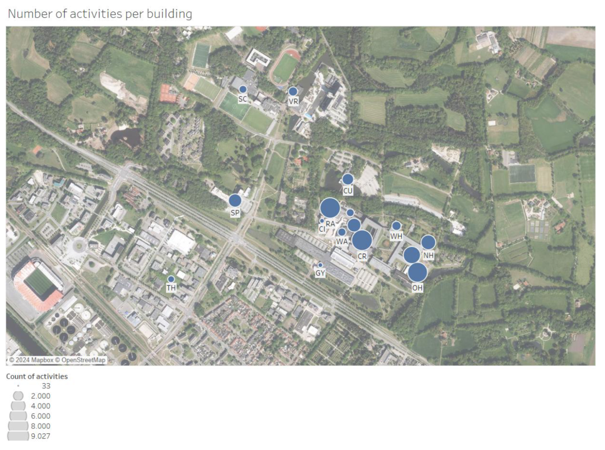

# University Timetable Analysis

**Course:** Data Science (Edition: 2023-1B)
**Authors:** Boris Belchev (s2388952), David Galati (s2539829)

## [FullReport](./Group28_report.pdf)

## 1. Project Motivation

The efficient structuring of academic timetables is pivotal in shaping the educational experience within universities. This project explores the timetables of the University of Twente from 2013 to 2017, aiming to uncover potential flaws and irregularities that could impact the effectiveness of student and teacher schedules.

Research has underscored the significance of ample contact hours in enhancing student engagement and learning outcomes, highlighting the crucial role of well-planned timetables in maximizing these interactions. Optimizing timetables is not merely about aligning classes; it also involves the strategic allocation of classrooms and resources across the campus to reduce transit times and ensure the optimal use of time, as studies suggest that high transit times have a negative impact on student satisfaction.

By analyzing the schedules of various study programs, this study endeavors to determine whether certain programs inherently benefit from more advantageous timetables, adhering to the Key Performance Indicators (KPIs) set forth by the university. This comparison seeks to identify disparities across programs, delving into how these differences might influence the overall academic quality and student experience.

## 2. Technical Implementation

This project involves a data-driven approach to analyze university timetable data. The core of the implementation includes:

* **Data Extraction:** Processing raw timetable data from various sources.
* **Data Cleaning:** Using Python libraries like Pandas to handle inconsistencies, missing values, and encoding issues (e.g., converting text to a consistent format like 'latin1').
* **Database Management:** Structuring the cleaned data and inserting it into a SQL database for querying and analysis. Key tables include `teachers`, `programs`, `courses`, and `activities`.
* **Data Transformation:** Dropping duplicate entries and restructuring dataframes to ensure data integrity before database insertion.

## 3. How to Use

To run this project, you will need to:
1.  Set up a Python environment with necessary libraries (e.g., Pandas, SQLAlchemy).
2.  Configure the database connection engine.
3.  Execute the data processing scripts to populate the database.
4.  Use the populated database for further analysis and to generate insights based on the project's KPIs.
